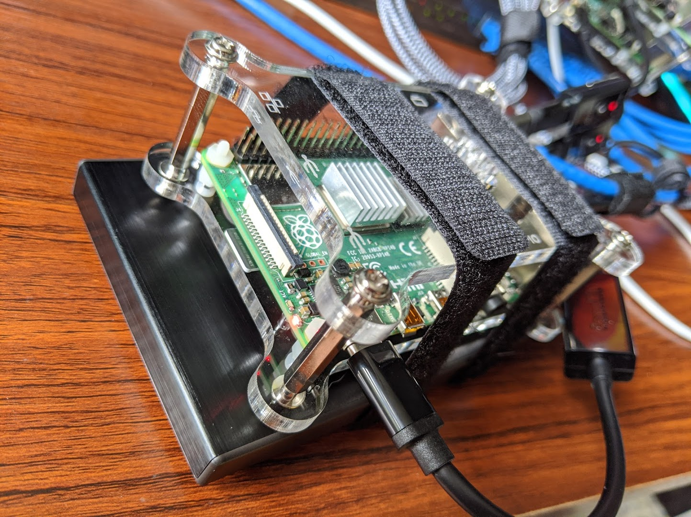

#This repository is archived and will no longer receive updates.

# Dynamic Persistent Volumes for your Raspberry Pi Kubernetes cluster with the NFS Client Provisioner

Ephemeral containers are useful, but sometimes data needs to persist between containers, or be shared between multiple containers. The solution to this is mounting external volumes inside the containers, and this is done in Kubernetes with persistent volumes. In large, public cloud deployments, Kubernetes has integrations with the cloud providers block storage back ends, allowing developers to create claims for volumes to use with their deployments, and Kubernetes works with the cloud provider to create a volume and mount in the developers' pods.

We can replicate this same behavior in our Private Cloud at Home Kubernetes cluster using the NFS-client provisioner from the [Kubernetes Incubator external storage project](https://github.com/kubernetes-incubator/external-storage).



In a previous article, we setup an [NFS server with a Raspbery Pi](https://opensource.com/article/20/5/nfs-raspberry-pi). We can use this NFS server to back the storage provided by the NFS-client provisioner. The provisioner runs a container which mounts an NFS export from our NFS server, and carves it up into "volumes" when a persistent volume claim is created, requesting volumes for a pod. [Kubernetes supports NFS volume types natively](https://github.com/kubernetes-incubator/external-storage), and handles mounting the volumes inside the containers when a pod starts.

The NFS-client provisioner gives us the benefit of dynamically provisioned volumes, and makes our homelab cluster behave similar to a Kubernetes cluster in the cloud. In addition, because these are NFS volumes, they can support multi-read/multi-write operations, so multiple pods can have the volumes mounted at the same time. This is useful for load-balanced services like webserver, where multiple pods can be spread across multiple nodes to handle traffic and provide greater availability. NFS volumes can also be created supporting only read/write once operations. This is better for database or other instances where the software writing to the volume does not handle multiple write operations nicely.

## Persistent volumes, persistent volume claims, and storage classes

_Persistent volumes_ are volumes backed by non-ephemeral storage that can be mounted as a volume inside of a container. Data written into that volume persists across container restarts, and can be mounted into new pods when they replace old ones. In the case of NFS volumes, the volumes can be mounted into multiple containers at the same time, allowing the data to be shared.

Developers can request a persistent volume from Kubernetes with a _persistent volume claim._ This is exactly what it sounds like: a request for a volume that matches certain conditions, such as access modes or size, and that can be claimed and used for their project. Persistent volumes request specific volume types using storage classes.

_Storage classes_ describe types of volumes that can be claimed, allowing developers to choose volume types that will best work with what they need.  Administrators can create multiple types of storage classes to meet specific needs, like access mode or size, as mentioned above, or even speed/IOPS classes or different back-end technologies. Storage classes can also specify a particular provisioner, or software in charge of creating and managing the volumes.

Cluster administrators can maintain a large pool of pre-provisioned volumes created manually to satisfy the storage classes, but that requires hands-on work and does not scale well. With a dynamic volume provisioner, we can have software handle the creation of volumes on-demand when a new claim is created. The NFS-client provisioner has by default a single storage class, and persistent volume claims that request volumes from this storage class are fulfilled by the provisioner itself.

Further reading, if you are interested:

* [persistent volumes](https://kubernetes.io/docs/concepts/storage/persistent-volumes/)
* [persistent volume claims](https://kubernetes.io/docs/concepts/storage/persistent-volumes/#persistentvolumeclaims)
* [storage classes](https://kubernetes.io/docs/concepts/storage/storage-classes/)

## The NFS-client provisioner

The nfs-client provisioner, as mentioned above, is a part of the Kubernetes Incubator project. In a Kubernetes cluster, this provisioner runs in a container that mounts an NFS export from an _existing_ NFS server - it does not run an NFS server itself. With the container, it listens for persistent volume claims that match its storage class, and creates directories within the NFS export, and reports each directory to Kubernetes as a persistent volume. Kubernetes can then mount the volume into container that use the volumes from that persistent volume claim.

Installation of the NFS-client provisioner can be done with a Helm chart, as described in the [README.md for the project](https://github.com/kubernetes-incubator/external-storage/tree/master/nfs-client#with-helm), but for both educational reasons, and because we are running a Kubernetes cluster on Raspberry Pis and need to make a few adjustments, we will install it manually on our Private Cloud at Home cluster.

### Prerequisites

There are two prerequisites that must be done before we can use the NFS-client provisioner:

1. find the details of the NFS server (the ip address and path to the export)
2. the NFS libraries must be installed on each of the Kubernetes nodes that might run pods that need the NFS volumes

If you installed your own NFS server, such as the one we created in an [earlier article for our Private Cloud at Home homelab](https://opensource.com/article/20/5/nfs-raspberry-pi), then you should know the IP address of the server and the path to its exported filesystem. Make sure the export list includes all the Kubernetes nodes that might run pods with the NFS volumes.

You also need to install the NFS libraries on each of these nodes, so they will be able to mount the NFS volumes. On Ubuntu, Raspbian or other Debian-based OSs, you can install the `nfs-common` package using `apt`. For Red Hat-based distributions, install the `nfs-utils` package.

With the prerequisites out of the way, you can move on to installing the NFS-client provisioner onto the Kubernetes cluster.

## Installation

The NFS-client provisioner is deployed using standard Kubernetes objects. You can find these in the Kubernetes Incubator external storage project, within the nfs-client directory. To get started, clone the `https://github.com/kubernetes-incubator/external-storage` repository:

```shell
# Clone the external-storage repo
# (output omitted)
$ git clone https://github.com/kubernetes-incubator/external-storage.git
```

The specific pieces need to install the NFS-client provisioner are in `nfs-client/deploy`:

```shell
$ cd external-storage/nfs-client/deploy
$ ls
class.yaml           deployment.yaml  rbac.yaml        test-pod.yaml
deployment-arm.yaml  objects          test-claim.yaml
```

_Note:_ The _objects_ directory contains everything from its parent directory, just broken out to a single file per object.

Before doing anything else, the appropriate RBAC permissions must be created, to allow the NFS-client provisioner service account to mount volumes, create persistent volume claims, etc. They can be created on the cluster with the `kubectl create` command.

If you plan to deploy the provisioner in a namespace other than the _default_ namesapce, make sure to change the namespace in the RBAC and deployment files first.

```shell
# Create the RBAC permissions needed by the provisioner
kubectl create -f rbac.yaml
serviceaccount/nfs-client-provisioner created
clusterrole.rbac.authorization.k8s.io/nfs-client-provisioner-runner created
clusterrolebinding.rbac.authorization.k8s.io/run-nfs-client-provisioner created
role.rbac.authorization.k8s.io/leader-locking-nfs-client-provisioner created
rolebinding.rbac.authorization.k8s.io/leader-locking-nfs-client-provisioner created
```

Next, we need to create a deployment for the NFS-client provisioner pod. If you created your Kubernetes cluster following the [Build a Kubernetes cluster with the Raspberry Pi](https://opensource.com/article/20/5/kubernetes-raspberry-pi) or created your own on an ARM-based system, you will need to modify and deploy using the _deployment-arm.yaml_ file. If you are using and x86_64-based system, use the _deployment.yaml_ file.

Edit the file with your editor of choice. Four things need to be changed. First, the three environment variables from the `.spec.template.containers.env` list need to be set.

* Change the value for `PROVISIONER_NAME` to `nfs-storage` (Optional; this just makes it a little more human-friendly.)
* Change the `NFS_SERVER` value to the IP address of your NFS server
* Change the `NFS_PATH` value to the path of your NFS export

Finally, under `.spec.template.spec.volumes.nfs`, change the `server` and `path` values to the same as you set for the `NFS_SERVER` and `NFS_PATH`, respectively.

For example, an NFS server and export path of `192.168.2.123:/srv`, the _deployemnt-arm.yaml_ file would look like this:

```yaml
apiVersion: apps/v1
kind: Deployment
metadata:
  name: nfs-client-provisioner
  labels:
    app: nfs-client-provisioner
  namespace: default
spec:
  replicas: 1
  strategy:
    type: Recreate
  selector:
    matchLabels:
      app: nfs-client-provisioner
  template:
    metadata:
      labels:
        app: nfs-client-provisioner
    spec:
      serviceAccountName: nfs-client-provisioner
      containers:
        - name: nfs-client-provisioner
          image: quay.io/external_storage/nfs-client-provisioner-arm:latest
          volumeMounts:
            - name: nfs-client-root
              mountPath: /persistentvolumes
          env:
            - name: PROVISIONER_NAME
              value: nfs-storage
            - name: NFS_SERVER
              value: 192.168.2.123
            - name: NFS_PATH
              value: /srv
      volumes:
        - name: nfs-client-root
          nfs:
            server: 192.168.2.123
            path: /srv
```

Once the _deployment-arm.yaml_ file has been modified as needed, create the deployment with the `kubectl create` command:

```shell
# Create the deployment
$ kubectl create -f deployment-arm.yaml
deployment.apps/nfs-client-provisioner created

# Check that the deployment created the provisioner pod correctly
$ kubectl get po
NAME                                      READY   STATUS    RESTARTS   AGE
nfs-client-provisioner-6ddfb9bb6d-x4zwt   1/1     Running   0          54s
```

If all worked correctly, the NFS-client provisioner is now running in your cluster. If the pod has the status `ContainerCreating`, and it does not eventually change to `Running`, check for any relevant events using the `kubectl get events` command. Make sure that the user "nobody" as write permissions on the export directory on the NFS server. If there are no issues, move on to creating the storage class.

The _class.yaml_ file needs to be modified to set the `provisioner` value to `nfs-storage`, or whatever you set for the `PROVISIONER_NAME` value in the _deployment-arm.yaml_. This tell Kubernetes which provisioner needs to be used to fulfill persistent volume claims for this storage class. Assuming you choose `nfs-storage`, the _class.yaml_ file should look like this:

```yaml
apiVersion: storage.k8s.io/v1
kind: StorageClass
metadata:
  name: managed-nfs-storage
provisioner: nfs-storage # or choose another name, must match deployment's env PROVISIONER_NAME'
parameters:
  archiveOnDelete: "false"
```

Create the storage class with the `kubectl create` command:

```shell
# Create the storage class
$ kubectl create -f class.yaml
storageclass.storage.k8s.io/managed-nfs-storage created

# Verify the storage class was created
$ kubectl get storageClass
NAME                  PROVISIONER   RECLAIMPOLICY   VOLUMEBINDINGMODE   ALLOWVOLUMEEXPANSION   AGE
managed-nfs-storage   nfs-storage   Delete          Immediate           false
```

Success! The NFS-client provisioner is now installed in the Kubernetes cluster and prepared to dynamically allocate persistent storage volumes for your pods in response to persistent volumes claims against the `managed-nfs-storage` storage class!

## Test your new volume provisioner

With the provisioner installed and configured you can test it out by creating a PVC requesting a persistent volume, and a pod to mount the volume. Luckily, there are test objects provided with the files used for the deployment: _test-claim.yaml_ and _test-pod_.yaml.

Before creating a PVC and a pod, take a look at what is already there. Unless you have created some already, there should be no persistent volumes, and no persistent volume claims.

```shell
# Look for existing persistent volumes
$ kubectl get persistentvolumes
No resources found in default namespace.

# Look for existing persistent volume claims
$ kubectl get persistentvolumeclaims
No resources found in default namespace.
```

Now, create a new PVC from the _test-claim.yaml_file:

```shell
# Create a test PVC
$ kubectl create -f test-claim.yaml
persistentvolumeclaim/test-claim created

$ kubectl get persistentvolumeclaims
NAME         STATUS   VOLUME                                     CAPACITY   ACCESS MODES   STORAGECLASS          AGE
test-claim   Bound    pvc-bdf41489-abe4-4508-8adc-74e80f70c626   1Mi        RWX            managed-nfs-storage   7s
```

From the output above, you can see a persistent volume claim named "test-claim" was created and bound.  This claim is tied to a volume named `pvc-bdf41489-abe4-4508-8adc-74e80f70c626`, created automatically by the NFS-client provisioner! Also note the `STORAGECLASS` is `managed-nfs-storage` - the name of the storage class we created.

Do not worry about the `CAPACITY` value. The NFS-client provisioner does not have a way to enforce storage quota - NFS does not have that feature. The `1Mi` is a placeholder.

Now that the persistent volume claim and its associated persistent volume have been created by the NFS-client provisioner, log into your NFS server and check out what happened on that end:

```shell
# From the NFS host, with the directory used for the NFS export
$ ls -la
total 4
drwxr-xr-x  3 nobody  root      73 May 25 18:46 .
drwxr-xr-x 21 root   root    4096 May 25 17:37 ..
drwxrwxrwx  2 nobody nogroup    6 May 25 18:45 default-test-claim-pvc-bdf41489-abe4-4508-8adc-74e80f70c626
```

A new directory has been created, following the naming convention "namespace-pvc_name-pv_name". This directory is initially empty. We can create a test pod to mount this directory via NFS, and write to it.

First, if your cluster is using Raspberry Pis or other ARM-based hosts, the _test-pod.yaml_ file needs to be modified to use a busybox image created for ARM hosts. The default will pull from the `gcr.io` registry, but does not have the correct architecture for the `sh` binary, resulting in "exec format" errors. If your Kubernetes cluster is running on x86_64 hosts, you can skip this step.

Change the `test-pod.yaml` file to use the "docker.io/aarch64/busybox:latest" container image. Your file should look like this:

```yaml
kind: Pod
apiVersion: v1
metadata:
  name: test-pod
spec:
  containers:
  - name: test-pod
    image: docker.io/aarch64/busybox:latest
    # image: gcr.io/google_containers/busybox:1.24
    command:
      - "/bin/sh"
    args:
      - "-c"
      - "touch /mnt/SUCCESS && exit 0 || exit 1"
    volumeMounts:
      - name: nfs-pvc
        mountPath: "/mnt"
  restartPolicy: "Never"
  volumes:
    - name: nfs-pvc
      persistentVolumeClaim:
        claimName: test-claim
```

The pod described in the file will create a busybox container, mount the NFS volume from the "test-claim" persistent volume to `/mnt` inside the contianer, and create a file named "SUCCESS".

```shell
# Creae the test pod container
$ kubectl create -f test-pod.yaml
pod/test-pod created

# Validate the container ran without problem
$ kubectl get po
NAME                                      READY   STATUS      RESTARTS   AGE
nfs-client-provisioner-6ddfb9bb6d-x4zwt   1/1     Running     0          20m
test-pod                                  0/1     Completed   0          65s
```

If the container ran correctly and the status is `Completed`, then check the contents of the volume back on your NFS server:

```shell
# From the NFS server, within the directory for the PVC
$ ls default-test-claim-pvc-bdf41489-abe4-4508-8adc-74e80f70c626/
SUCCESS
```

Success indeed! The pod was able to mount the NFS volume created by the NFS-client provisioner and write to it!

Clean up the test pod and pvc with the `kubectl delete` command:

```shell
# Cleanup the test-pod pod
$ kubectl delete po test-pod
pod "test-pod" deleted

# Cleanup the test-claim pvc
$ kubectl delete pvc test-claim
persistentvolumeclaim "test-claim" deleted
```

## Turn up the volume(s)

Thanks to the NFS-client provisioner and our NFS server, we can now request persistent volumes to use with our pods by creating persistent volume claims, and the claims will be automatically filled with dynamically provisioned NFS volumes. This mirrors in most aspects how Kubernetes works with dynamic provisioners in the large public clouds, and allows us to use a similar workflow to one we could use with the public cloud providers. In fact, one of the benefits of storage classes are the abstraction created between the persistent volume claims and the providers of the volumes. This allows for the use of storage classes of the same name and different providers between on-premises private clouds and any of the public cloud providers, making it easier to "lift-and-shift" workloads between them.

By using NFS, we can support multi-read and multi-write operations on the volumes, too, allowing multiple pods to make use of the volumes at the same time. As mentioned, this is great for load-balanced webservers or similar services, and allows us to scale our services across multiple nodes at the same time.

Best of all, the NFS-client provisioner is automatic, dynamically creating volumes within the NFS export so they do not have to be manually provisioned ahead of time!

Take your new NFS-client provisioner out for a spin, and create some projects that need persistent storage. Perhaps try (shameless plug incoming) [Deploying InfluxDB and Grafana on Kubernetes to collect Twitter stats](https://opensource.com/article/19/2/deploy-influxdb-grafana-kubernetes).
